# 🚀 Netlify Deployment Guide for Bench Prediction Market

This guide will help you deploy your Bench prediction market application to Netlify.

## 📋 Prerequisites

- A [Netlify account](https://app.netlify.com/signup) (free tier works!)
- Your code pushed to a Git repository (GitHub, GitLab, or Bitbucket)
- Firebase project credentials
- Avalanche RPC URL and contract addresses

---

## 🎯 Quick Deploy Steps

### 1. **Connect to Netlify**

#### Option A: Deploy via Netlify UI (Recommended)
1. Go to [Netlify](https://app.netlify.com/)
2. Click **"Add new site"** → **"Import an existing project"**
3. Connect your Git provider (GitHub, GitLab, etc.)
4. Select your `bench_prediction_market_website` repository

#### Option B: Deploy via Netlify CLI
```bash
# Install Netlify CLI
npm install -g netlify-cli

# Login to Netlify
netlify login

# Initialize and deploy
netlify init
netlify deploy --prod
```

---

### 2. **Configure Build Settings**

Netlify should auto-detect your SvelteKit settings. Verify these in the build settings:

- **Build command:** `npm run build`
- **Publish directory:** `build`
- **Node version:** `18` (set in `netlify.toml`)

---

### 3. **Set Environment Variables**

Go to **Site settings** → **Environment variables** and add these:

#### **Firebase Configuration (Required)**
```
PUBLIC_FIREBASE_API_KEY=your_firebase_api_key
PUBLIC_FIREBASE_AUTH_DOMAIN=your_project.firebaseapp.com
PUBLIC_FIREBASE_PROJECT_ID=bench-prediction-market
PUBLIC_FIREBASE_STORAGE_BUCKET=your_project.appspot.com
PUBLIC_FIREBASE_MESSAGING_SENDER_ID=your_sender_id
PUBLIC_FIREBASE_APP_ID=your_app_id
```

#### **Avalanche Network Configuration (Required)**
```
PUBLIC_AVALANCHE_RPC_URL=https://api.avax-test.network/ext/bc/C/rpc
PUBLIC_CHAIN_ID=43113
```

#### **Smart Contract Addresses (Required)**
```
PUBLIC_PREDICTION_MARKET_CONTRACT=0xYourContractAddress
PUBLIC_X402_PAYMENT_CONTRACT=0xYourX402Address
PUBLIC_ERC8004_TOKEN_CONTRACT=0xYourERC8004Address
```

📝 **Note:** All variables starting with `PUBLIC_` are exposed to the client-side code.

---

### 4. **Deploy!**

Click **"Deploy site"** and Netlify will:
1. Clone your repository
2. Install dependencies
3. Build your SvelteKit app
4. Deploy to a global CDN

Your site will be live at: `https://your-site-name.netlify.app`

---

## 🔧 Post-Deployment Configuration

### **Custom Domain (Optional)**
1. Go to **Site settings** → **Domain management**
2. Click **"Add custom domain"**
3. Follow the DNS configuration instructions

### **HTTPS (Automatic)**
Netlify provides free SSL certificates automatically!

### **Continuous Deployment**
Every push to your main branch will automatically trigger a new deployment.

---

## 📝 Getting Your Environment Variables

### Firebase Configuration:
1. Go to [Firebase Console](https://console.firebase.google.com/)
2. Select your `bench-prediction-market` project
3. Go to **Project Settings** → **General**
4. Scroll to "Your apps" section
5. Copy the config values

### Avalanche Configuration:
- **RPC URL (Fuji Testnet):** `https://api.avax-test.network/ext/bc/C/rpc`
- **Chain ID:** `43113`
- **Get testnet AVAX:** [Avalanche Faucet](https://faucet.avax.network/)

### Smart Contract Addresses:
1. Go to your `contracts/.env` file (local)
2. Find the deployed contract addresses after running:
   ```bash
   cd contracts
   npx hardhat run scripts/deploy.js --network fuji
   ```
3. Copy the addresses from the console output

---

## 🐛 Troubleshooting

### Build Fails
```bash
# Test build locally first
npm run build
```

### Environment Variables Not Working
- Make sure variable names start with `PUBLIC_` for client-side access
- Redeploy after adding new environment variables
- Check the deploy logs for missing variables

### MetaMask Not Connecting
- Ensure `PUBLIC_CHAIN_ID` is set to `43113` (Fuji testnet)
- Verify `PUBLIC_AVALANCHE_RPC_URL` is correct

### Firebase Errors
- Check all Firebase environment variables are set
- Verify Firebase project ID matches your actual project

---

## 🎨 Custom Build Commands

If you need custom build behavior, modify `netlify.toml`:

```toml
[build]
  command = "npm run build"
  publish = "build"

[build.environment]
  NODE_VERSION = "18"
  NPM_FLAGS = "--legacy-peer-deps"  # If needed
```

---

## 📊 Monitoring & Analytics

### Netlify Analytics (Paid)
Enable in **Site settings** → **Analytics**

### Custom Analytics
Add Google Analytics or Plausible in your `+layout.svelte`:

```svelte
<script>
  // Add your analytics code here
</script>
```

---

## 🔄 Deployment Workflow

```mermaid
graph LR
    A[Push to Git] --> B[Netlify Auto-Build]
    B --> C[Run Tests]
    C --> D[Build SvelteKit]
    D --> E[Deploy to CDN]
    E --> F[Live Site 🎉]
```



---

## 📱 Preview Deployments

Netlify automatically creates preview deployments for pull requests!

- **Production:** `https://your-site.netlify.app`
- **Preview:** `https://deploy-preview-123--your-site.netlify.app`

---

## ⚡ Performance Tips

1. **Enable Build Plugins:**
   - Next.js Build Plugin (if migrating)
   - Image optimization
   - HTML minification

2. **Configure Caching:**
   Already set in `netlify.toml` for optimal caching!

3. **Use Edge Functions:**
   For server-side logic at the edge (optional)

---

## 🎯 Next Steps After Deployment

1. ✅ Test wallet connection on production
2. ✅ Verify all markets load correctly
3. ✅ Test placing a bet with testnet AVAX
4. ✅ Check responsive design on mobile
5. ✅ Set up custom domain (optional)
6. ✅ Enable branch deploys for testing

---

## 🆘 Need Help?

- **Netlify Docs:** https://docs.netlify.com/
- **SvelteKit Docs:** https://kit.svelte.dev/
- **Netlify Support:** https://answers.netlify.com/

---

## 🚀 Deploy Status Badge

Add this to your README.md:

```markdown
[](https://app.netlify.com/sites/YOUR-SITE-NAME/deploys)
```

Get your site ID from: **Site settings** → **General** → **Site details**

---

**Your Bench prediction market is now live! 🎉**

Users can connect their MetaMask wallets and start betting with AVAX on Avalanche!


